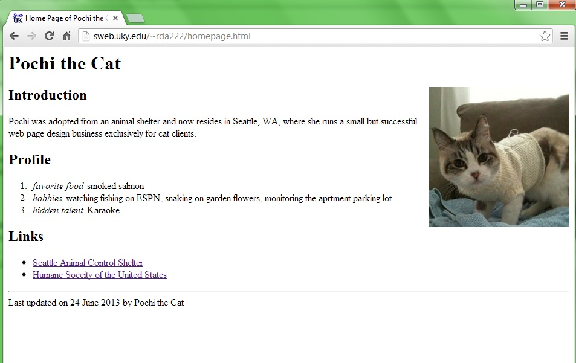
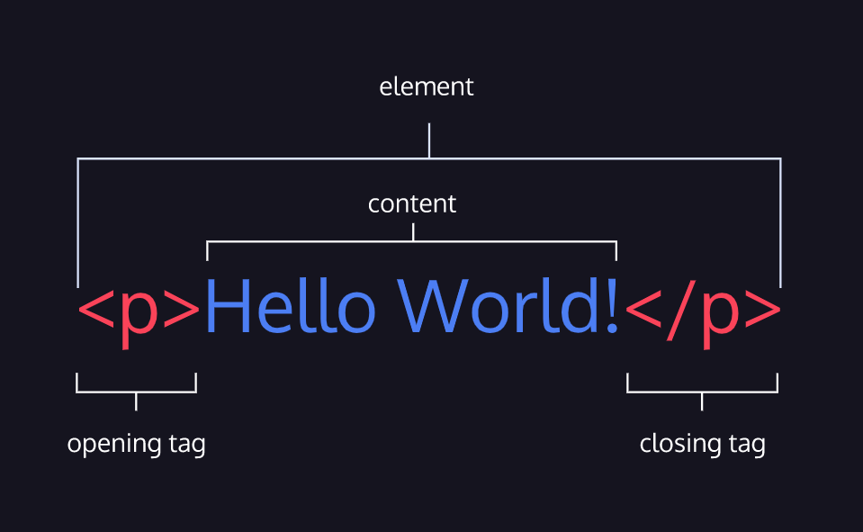
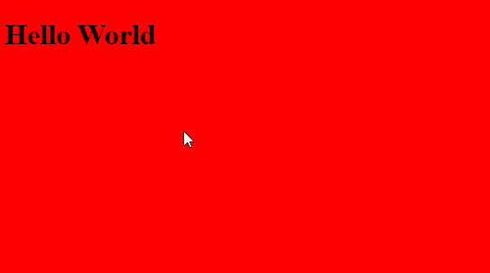

HTML: **HyperText Markup Language**
HTML: **Hiper Metni İşaretleme Dili**

Html Front-End geliştirmenin ilk adımıdır. Html Web sayfalarının temelidir. Standart bir işaretlemedilir.
Burada rogramlama dillerinden ayrılmaktadır. Tek başına bir site oluşturabilirsiniz fakat bu site oldukca basit ve görsel olarak bir işlevi olmayan bir site olacaktır.

Sadece Html ullanılarak oluşturulmuş bir siteye göz atalım:



Şuan kullanılan html sürümü 5.0'dır.

HTML öğrenmek, web siteleri oluşturmanın ilk adımıdır, ancak biraz bilgi bile haber bültenlerine, bloglara veya web sitesi şablonlarına kod parçacıkları eklemenize yardımcı olabilir. Öğrenmeye devam ederken, görsel olarak çekici ve dinamik web siteleri oluşturmak için HTML'yi CSS ve JavaScript ile katmanlayabilirsiniz. Ancak şimdilik, bir sayfaya metin, resim ve videolar gibi temel içeriğin nasıl ekleneceğine ve değiştirileceğine odaklanacağız.

## HTML Anatomy

HTML öğelerden oluşur . Bu öğeler web sayfasını yapılandırır ve içeriğini tanımlar. Nasıl yazıldığına bir göz atalım.



Bu diyagram bir HTML paragraf öğesini görüntüler. Gördüğümüz gibi, paragraf öğesi şunlardan oluşur:

* Bir paragraf açılış öğesi
* İçerik
* Bir paragraf kapanış öğesi

Resimdeki öğenin her bir parçasını hızlıca gözden geçirelim:

* HTML öğesi (veya basitçe öğe) — HTML etiketleri ve içerdiği metin veya medya tarafından oluşturulan bir HTML belgesindeki içerik birimi.
* `<` HTML Etiketi — bir açılış ve kapanış `>`.
* İçerik — Bir HTML öğesinin açılış ve kapanış etiketleri arasında yer alan bilgiler (metin veya diğer öğeler).
* Kapanış etiketi — bir HTML öğesini sonlandırmak için kullanılan ikinci HTML etiketi. Kapanış etiketlerinin `/` içinde, sol açılı ayraçtan hemen sonra bir eğik çizgi bulunur. (`</p>`)
  
## Html Temel Öğeler

Tüm HTML belgeleri, bir belge türü bildirimi ile başlamalıdır: `<!DOCTYPE html>`
HTML belgesinin kendisi ile başlar `<html>` ve ile biter `</html>`
HTML belgesinin görünen kısmı ve `<body>` arasındadır `</body>`
HTML `<head>` öğesi şu öğeler için bir kapsayıcıdır: `<title>`, `<style>`, `<meta>`, `<link>`, `<script>` ve `<base>`.

### Basit Bir HTML Belgesi

```html
<!DOCTYPE html>
<html>
  <head>
    <title>Title</title>
    <style>
      body {
        background-color: #fff;
      }
    </style>
  </head>
  <body>
    <h1>Hello World</h1>
  </body>
</html>
```

Ekran Çıktısı:



Öcelikle Temel Elementleri inceleyelim:

* `<!DOCTYPE html>` -> DOCTYPE, hazırladığınız sayfaların hangi tipte bir belge olduğunu tarayıcıya (browser) bildirmek için kullanılır. Bu sayede tarayıcı bu sayfayı hangi standarda (hangi HTML sürümü kullanılmış) göre yorumlayacağını anlamış olur.
Eğer DOCTYPE kullanılmazsa tarayıcılar sayfaları standarda uygun olarak yorumlamayacak, dolayısıyla her tarayıcı size farklı farklı sonuçlar verecektir.
  * DOCTYPE Nerede Tanımlanır? -> DOCTYPE tanımlaması `<html>` etiketinin bir üst satırında olmalı ve DOCTYPE tanımlamasının üstünde hiçbir şey olmamalıdır.
  * DOCTYPE Versiyonları -> Her HTML versiyonu için değişik DOCTYPE tanımlaması vardır. Aşağıda bütün HTML versiyonları için DOCTYPE tanımlamalarını göreceksiniz.
  * Html 5 -> `<!DOCTYPE html>`
  * HTML 4.01 Strict -> `<!DOCTYPE HTML PUBLIC "-//W3C//DTD HTML 4.01//EN" "http://www.w3.org/TR/html4/strict.dtd">`
  * HTML 4.01 Transitional -> `<!DOCTYPE HTML PUBLIC "-//W3C//DTD HTML 4.01 Transitional//EN" "http://www.w3.org/TR/html4/loose.dtd">`
  * HTML 4.01 Frameset -> `<!DOCTYPE HTML PUBLIC "-//W3C//DTD HTML 4.01 Frameset//EN" "http://www.w3.org/TR/html4/frameset.dtd">`
  * XHTML 1.0 Strict -> `<!DOCTYPE html PUBLIC "-//W3C//DTD XHTML 1.0 Strict//EN" "http://www.w3.org/TR/xhtml1/DTD/xhtml1-strict.dtd">`
  * XHTML 1.0 Transitional -> `<!DOCTYPE html PUBLIC "-//W3C//DTD XHTML 1.0 Transitional//EN" "http://www.w3.org/TR/xhtml1/DTD/xhtml1-transitional.dtd">`
  * XHTML 1.0 Frameset -> `<!DOCTYPE html PUBLIC "-//W3C//DTD XHTML 1.0 Frameset//EN" "http://www.w3.org/TR/xhtml1/DTD/xhtml1-frameset.dtd">`
  * XHTML 1.1 -> `<!DOCTYPE html PUBLIC "-//W3C//DTD XHTML 1.1//EN" "http://www.w3.org/TR/xhtml11/DTD/xhtml11.dtd">`
* `<html> </html>` -> HTML belgesinin başlangıç ve bitiş etiketleri. Onun dışına yazdıklarınızın bir etkisi yoktur. SAdece bir kere tanımlanır ve diğer elementler bu tagın içine yerleştirilir.
* `<head> </head>` -> HTML sayfasının içerisinde yer alması gereken ancak bunları sayfa üzerine yazdırmamak ve ziyaretçilere göstermemek için kullanılan gizleme etiketidir. Head etiketi içerisinde kullanılan bilgiler internet tarayıcıları, arama motorlarının botları ve örümcekler tarafından kullanılmaktadır.
  * İçinde kullanılabilecek öğeler `<head>`:
  * `<title>` -> başlık çubuğunda veya bir sayfanın sekmesinde gösterilen belgenin başlığını tanımlar. Yalnızca metin içerir; eleman içindeki etiketler yoksayılır.
  * `<base>` -> bir belgedeki tüm base URL'ler için kullanılacak temel URL'yi belirtir . Bir belgede yalnızca bir öğe olabilir. Örnek:
    * `<base href="https://www.example.com/">`
    * `<base target="_blank">`
    * `<base target="_top" href="https://example.com/">`
  * `<link>` ->  geçerli belge ile bir dış kaynak arasındaki ilişkileri belirtir. Bu öğe en yaygın olarak stil sayfalarına bağlanmak için kullanılır , ancak diğer şeylerin yanı sıra site simgeleri (hem "favicon" stil simgeleri hem de ana ekran ve mobil cihazlardaki uygulamalar için simgeler) oluşturmak için kullanılır. Örneğin:
    * `<link href="main.css" rel="stylesheet"></link>`
    * `<link rel="icon" href="favicon.ico"></link>`
    * `<link rel="apple-touch-icon-precomposed" sizes="114x114"href="apple-icon-114.png" type="image/png"></link>`
  * `<style>` -> bir belgenin veya bir belgenin parçasının stil bilgilerini içerir. Öğeyi içeren belgenin içeriğine uygulanan CSS'yi içerir. Örneğim:
    * `<style>p{color: red;}</style>`
  * `<meta>` -> bir belgenin veya bir belgenin parçasının meta bilgilerini içerir. Örneğim:
    * `<meta name="description" content="This is my page">`
    * `<meta name="keywords" content="HTML, CSS, XML, JavaScript">`
    * `<meta name="author" content="John Doe">`
    * `<meta name="viewport" content="width=device-width, initial-scale=1.0">`
    * `<meta charset="UTF-8">`
  * `<script>` -> yürütülebilir kodu veya verileri gömmek için kullanılır; bu genellikle JavaScript kodunu gömmek veya buna başvurmak için kullanılır. Örneğim:
    * `<script src="main.js"></script>`
  * `<noscript>` -> sayfadaki bir komut dosyası türü desteklenmiyorsa veya tarayıcıda komut dosyası oluşturma kapalıysa eklenecek bir HTML bölümünü tanımlar. Örneğim:
    * `<noscript>Your browser does not support JavaScript!</noscript>`
  * `<template>` -> bir sayfa yüklendiğinde hemen görüntülenmeyecek, ancak daha sonra JavaScript kullanılarak çalışma zamanı sırasında oluşturulabilecek HTML'yi tutmak için bir mekanizmadır.
