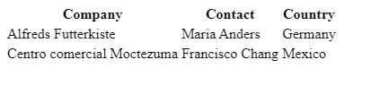
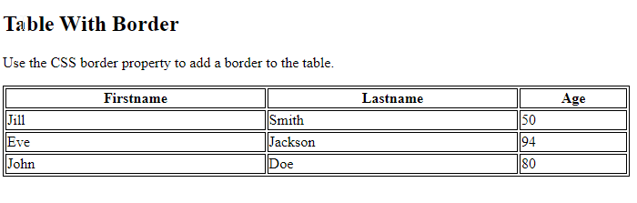
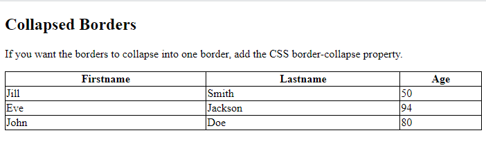
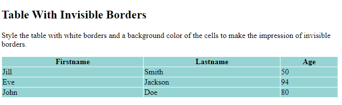
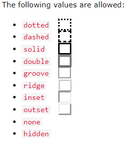
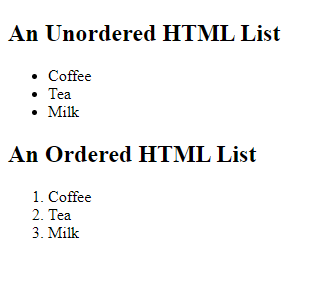
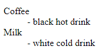
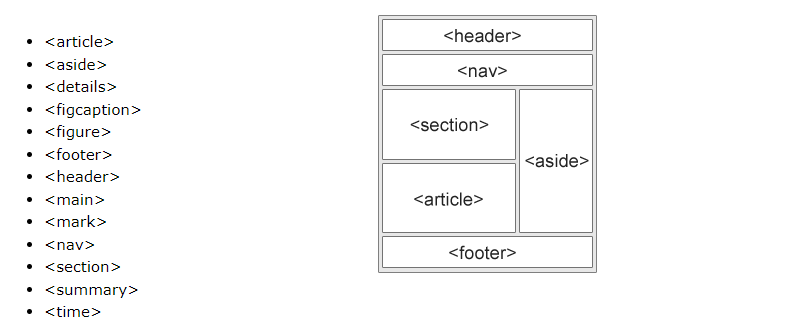

Bu sayfada temel kullanılan Html Elementlerini inceleyelim.

| Tag                          | Gösterim                   |
| ---------------------------- | -------------------------- |
| `<h1>This is heading 1</h1>` | <h1>This is heading 1</h1> |
| `<h2>This is heading 2</h2>` | <h2>This is heading 2</h2> |
| `<h3>This is heading 3</h3>` | <h3>This is heading 3</h3> |
| `<h4>This is heading 4</h4>` | <h4>This is heading 4</h4> |
| `<h5>This is heading 5</h5>` | <h5>This is heading 5</h5> |
| `<h6>This is heading 6</h6>` | <h6>This is heading 6</h6> |
| `<p>This is paragraph</p>`   | <p>This is paragraph</p>   |

Yukarıdaki bu öğeler temel yazım işlemleri içiin kullanılan öğelerdir.

- Link için `<a>` tag
  - Örnek : `<a href="https://www.google.com">Google</a>`
- Resimler için `` tag
  - Örnek : ``
- Bir satır aşağı inmek için `<br>` tag
  - Örnek : `<br>`
- Bir tabat için `<tab>` tag
  - Örnek : `<tab>`

## Biçimlendirme Öğeleri

1. `<b>` -> Kalın yazı
2. `<strong>`-> Önemli metin
3. `<i>`-> İtalik metin
4. `<em>`-> Vurgulanan metin
5. `<mark>`-> İşaretli metin
6. `<small>`-> Daha küçük metin
7. `<del>`-> Silinen metin
8. `<ins>`-> Eklenen metin
9. `<sub>`-> Alt simge metni
10. `<sup>`-> Üst simge metni

## Alıntı Öğeleri

1. `<abbr>` -> Bir kısaltma veya kısaltma tanımlar
2. `<address>` -> Bir adres veya adres tanımlar
3. `<bdo></bdo>` -> Metin yönünü tanımlar
4. `<blockquote>` -> Bir yazının alıntısının yapıldığı yer
5. `<cite></cite>` -> Bir eserin başlığını tanımlar
6. `<q>` -> Kısa bir satır içi teklif tanımlar

## Balantılar

HTML `<a>` etiketi bir köprüyü tanımlar. Aşağıdaki sözdizimine sahiptir:

`<a href="url">link text</a>`

Örnek Kullnaım:

`<a href="https://www.w3schools.com/">Visit W3Schools.com!</a>`

### HTML Bağlantıları - Hedef Nitelik

Varsayılan olarak, bağlantılı sayfa mevcut tarayıcı penceresinde görüntülenecektir. Bunu değiştirmek için bağlantı için başka bir hedef belirtebilirsiniz.

Nitelik **target**, bağlantılı belgenin nerede açılacağını belirtir.

Örnek yan sekmede açmak:

`<a href="https://www.w3schools.com/" target="_blank">Visit W3Schools.com!</a>`

- \_blank\* hedefi, yeni bir pencere açar.
- \_self\* Varsayılan. Belgeyi, tıklandığı pencerede/sekmede açar
- \_parent\* Ana pencereye/sekmede açar
- \_top\* Belgeyi pencerenin tam gövdesinde açar

### HTML Bağlantıları - Bir Resmi Bağlantı Olarak Kullan

Örnek:

`<a href="url" target="_blank"></a>`

### Bir E-posta Adresine Bağlantı

**mailto**: Kullanıcının e-posta programını açan bir bağlantı oluşturmak için özelliğin içinde kullanın href(yeni bir e-posta göndermelerine izin vermek için):

`<a href="mailto:someone@example.com">Send email</a>`

### Bağlantı Olarak Button

Bir HTML düğmesini bağlantı olarak kullanmak için biraz JavaScript kodu eklemeniz gerekir.
JavaScript, bir düğme tıklaması gibi belirli olaylarda ne olacağını belirtmenize olanak tanır:

`<button onclick="document.location='default.asp'">HTML Tutorial</button>`

## Html Görselleri

HTML `` etiketi, bir web sayfasına bir resim gömmek için kullanılır.

Görüntüler teknik olarak bir web sayfasına eklenmez; resimler web sayfalarına bağlıdır. ``etiketi, başvurulan görüntü için bir tutma alanı oluşturur .

Etiket `` boş, yalnızca öznitelikleri içeriyor ve bir kapanış etiketi yok.

Etiketin ``iki gerekli özelliği vardır:

- **src** - Resmin yolunu belirtir
- **alt** - Resim için alternatif bir metin belirtir

``

### Görüntü Boyutu - Genişlik ve Yükseklik

**style** Bir görüntünün genişliğini ve yüksekliğini belirtmek için özniteliği kullanabilirsiniz .

``

### HTML Resim Haritaları

HTML `<map>` etiketi bir görüntü haritasını tanımlar. Görüntü haritası, tıklanabilir alanları olan bir görüntüdür. Alanlar bir veya daha fazla `<area>` etiketle tanımlanır.

```html

<map name="trulli">
  <area
    shape="rect"
    coords="0,0,400,400"
    href="https://www.w3schools.com/html/html_images.asp"
    target="_blank"
  />
  <area
    shape="circle"
    coords="200,200,100"
    href="https://www.w3schools.com/html/html_images.asp"
    target="_blank"
  />
  <area
    shape="poly"
    coords="100,100,200,200,300,300"
    href="https://www.w3schools.com/html/html_images.asp"
    target="_blank"
  />
</map>
```

Tıklanabilir alanın şeklini tanımlamanız gerekir ve şu değerlerden birini seçebilirsiniz:

- **rect**- dikdörtgen bir bölge tanımlar
- **circle**- dairesel bir bölge tanımlar
- **poly**- çokgen bir bölge tanımlar
- **default**- tüm bölgeyi tanımlar

### HTML Arka Plan Resimleri

Hemen hemen her HTML öğesi için bir arka plan görüntüsü belirtilebilir.

Bir HTML öğesine arka plan resmi eklemek için HTML styleniteliğini ve CSS background-imageözelliğini kullanın:

`<p style="background-image: url('img_girl.jpg');">`

HTML `<picture>` öğesi, web geliştiricilerine görüntü kaynaklarını belirlemede daha fazla esneklik sağlar.

Öğe , her biri nitelik aracılığıyla farklı görüntülere atıfta bulunan bir `<picture>` veya daha fazla öğe içerir . Bu şekilde tarayıcı, mevcut görünüme ve/veya cihaza en uygun görüntüyü seçebilir.`<source>` srcset

Her `<source>` öğenin, mediagörüntünün en uygun olduğu zamanı tanımlayan bir özelliği vardır.

Farklı ekran boyutları için farklı resimler göster:

```html
<picture>
  <source media="(min-width: 650px)" srcset="img_food.jpg" />
  <source media="(min-width: 465px)" srcset="img_car.jpg" />
  
</picture>
```

## Table

```html
<table>
  <tr>
    <th>Company</th>
    <th>Contact</th>
    <th>Country</th>
  </tr>
  <tr>
    <td>Alfreds Futterkiste</td>
    <td>Maria Anders</td>
    <td>Germany</td>
  </tr>
  <tr>
    <td>Centro comercial Moctezuma</td>
    <td>Francisco Chang</td>
    <td>Mexico</td>
  </tr>
</table>
```



### Table Border

```html
<style>
table, th, td {
  border: 1px solid black;
}
</style>
</head>
<body>

<h2>Table With Border</h2>

<p>Use the CSS border property to add a border to the table.</p>

<table style="width:100%">
  <tr>
    <th>Firstname</th>
    <th>Lastname</th>
    <th>Age</th>
  </tr>
  <tr>
    <td>Jill</td>
    <td>Smith</td>
    <td>50</td>
  </tr>
  <tr>
    <td>Eve</td>
    <td>Jackson</td>
    <td>94</td>
  </tr>
  <tr>
    <td>John</td>
    <td>Doe</td>
    <td>80</td>
  </tr>
</table>

</body>
</html>
```



Bundan Sonraki örneklerde satce Style kısmı yer alacaktır.

```html
<style>
  table,
  th,
  td {
    border: 1px solid black;
    border-collapse: collapse;
  }
</style>
```



```html
<style>
  table,
  th,
  td {
    border: 1px solid white;
    border-collapse: collapse;
  }
  th,
  td {
    background-color: #96d4d4;
  }
</style>
```





## Lists

```html
<h2>An Unordered HTML List</h2>

<ul>
  <li>Coffee</li>
  <li>Tea</li>
  <li>Milk</li>
</ul>

<h2>An Ordered HTML List</h2>

<ol>
  <li>Coffee</li>
  <li>Tea</li>
  <li>Milk</li>
</ol>
```



- `<ul>` Sırasız bir liste tanımlar
- `<ol>` Sıralı bir liste tanımlar
- `<li>` Bir liste öğesi tanımlar
- `<dl>` Bir açıklama listesi tanımlar
- `<dt>` Açıklama listesinde bir terim tanımlar
- `<dd>` Bir açıklama listesindeki terimi açıklar

```html
<dl>
  <dt>Coffee</dt>
  <dd>- black hot drink</dd>
  <dt>Milk</dt>
  <dd>- white cold drink</dd>
</dl>
```



## Block-level Elements

Blok düzeyinde bir öğe her zaman yeni bir satırda başlar ve tarayıcılar otomatik olarak öğenin önüne ve arkasına biraz boşluk (kenar boşluğu) ekler.

Blok düzeyinde bir öğe her zaman mevcut olan tam genişliği kaplar (mümkün olduğunca sola ve sağa doğru uzanır).

Yaygın olarak kullanılan iki blok öğesi şunlardır: `<p>` ve `<div>`.

`<p>` Öğe, bir HTML belgesindeki bir paragrafı tanımlar.

`<div>` Öğe, bir HTML belgesindeki bir bölümü veya bölümü tanımlar.

HTML'deki blok düzeyindeki öğeler şunlardır:

| Tag            | Desc                                                                                               | Tag            | Desc                                                                                          |
| -------------- | -------------------------------------------------------------------------------------------------- | -------------- | --------------------------------------------------------------------------------------------- | -------- | ------------------------------------------------------- |
| `<address>`    | Bir belgenin veya makalenin yazarı/sahibi için iletişim bilgilerini tanımlar.                      | `<article>`    | bağımsız, kendi kendine yeten içeriği belirtir.                                               |
| `<aside>`      | Yerleştirildiği içeriğin dışında bazı içerikleri tanımlar.                                         | `<blockquote>` | başka bir kaynaktan alıntılanan bir bölümü belirtir.                                          |
| `<canvas>`     | Komut dosyası oluşturma (genellikle JavaScript) aracılığıyla anında grafik çizmek için kullanılır. | `<dd>`         | Bir açıklama listesindeki bir terimi/adı tanımlamak için kullanılır.                          |
| `<div>`        | Bir HTML belgesindeki bir bölümü veya bölümü tanımlar.                                             | `<dl>`         | etiketi, bir açıklama listesi tanımlar.                                                       |
| `<dt>`         | etiketi, bir açıklama listesinde bir terim/ad tanımlar.                                            | `<fieldset>`   | tiketi, ilgili öğeleri bir formda gruplamak için kullanılır.                                  |
| `<figcaption>` |                                                                                                    | `<figure>`     | tiketi, çizimler, diyagramlar, fotoğraflar, kod listeleri vb. gibi bağımsız içeriği belirtir. |
| `<footer>`     | etiketi, bir belge veya bölüm için bir altbilgi tanımlar.                                          | `<form>`       | kullanıcı girişi için bir HTML formu oluşturmak için kullanılır.                              |
| `<h1>-<h6>`    | Başlıklar                                                                                          | `<header>`     | Üst bilgi, bir belge veya bölümün başlığını tanımlar.                                         |
| `<hr>`         | Bir çizgi satırı tanımlar.                                                                         | `<li>`         | Bir liste öğesi tanımlar.                                                                     | `<main>` | etiketi, bir belge veya bölümün ana içeriğini tanımlar. |
| `<nav>`        | etiketi, bir belgenin veya makalenin navigasyonunu tanımlar.                                       | `<noscript>`   | etiketi, JavaScript kullanılmadan çalışmasını istemediğiniz içeriği belirtir.                 |
| `<ol>`         | etiketi, bir liste oluşturmak için kullanılır.                                                     | `<p>`          | etiketi, bir HTML belgesindeki bir paragrafı tanımlar.                                        |
| `<pre>`        | etiketi, bir HTML belgesindeki bir kod bloğunu tanımlar.                                           | `<section>`    | etiketi, bir belge veya bölümün bir bölümünü tanımlar.                                        |
| `<table>`      | etiketi, bir tablo oluşturmak için kullanılır.                                                     | `<tfoot>`      | etiketi, bir tablo için altbilgi tanımlar.                                                    | `<ul>`   | etiketi, bir liste oluşturmak için kullanılır.          |
| `<video>`      | etiketi, bir video oluşturmak için kullanılır.                                                     |

## Inline Elements

Satır içi öğe yeni bir satırda başlamaz.

Bir satır içi öğe yalnızca gerektiği kadar genişlik kaplar.

Bu, paragraf içindeki bir `<span>` öğesi gibi.

| Tag | Desc  | Tag |Desc |
| ---- | ---- | ---- | ---- |
| `<a>` | etiketi, bir sayfadan diğerine bağlantı vermek için kullanılan bir köprüyü tanımlar.| `<abbr>` | "HTML", "CSS", "Mr.", "Dr.", "ASAP", "ATM" gibi bir kısaltma veya kısaltma tanımlar. |
| `<acronym>` | HTML5'te Desteklenmez.| `<b>`| herhangi bir ekstra önem olmaksızın kalın metni belirtir.|
| `<bdo>`  | geçerli metin yönünü geçersiz kılmak için kullanılır.| `<big>`     | Not Supported in HTML5.| `<br>`| Bir satır alta iner.| `<button>` | Bir buton oluşturmak için kullanılır. |
| `<cite>`  | Bir başka bir kaynaktan alıntılan bir bölümü belirtmek için kullanılır. | `<code>` | Bir kod bloğu oluşturmak için kullanılır.        |
|`<dfn>`    | Bir tanım oluşturmak için kullanılır.            | `<em>`  | Bir metinin kalınımını artırmak için kullanılır. |
| `<i>`   | Bir metinin kalınımını artırmak için kullanılır. | ``      | Bir resim oluşturmak için kullanılır.       |
| `<input>` | Bir giriş kutusu oluşturmak için kullanılır. | `<kbd>` | Bir klavye kısayolu oluşturmak için kullanılır. |
| `<label>` | Bir etiket oluşturmak için kullanılır.   | `<map>` | Bir harita oluşturmak için kullanılır. | `<object>` | Bir objekt | `<output>` | Bir değer oluşturmak için kullanılır.|
|`<q>`    | Bir cümle oluşturmak için kullanılır.| `<samp>`    | Bir kod örneği oluşturmak için kullanılır. |
|`<script>` | Bir kod bloğu oluşturmak için kullanılır. | `<select>` | Bir seçim kutusu oluşturmak için kullanılır. |
|`<small>` | Bir metinin küçük harflerini artırmak için kullanılır.                  | `<span>` | Bir metinin kalınımını artırmak için kullanılır. |
|`<strong>` | Bir metinin kalınımını artırmak için kullanılır. | `<sub>` | Bir metinin altınını artırmak için kullanılır. |
|`<sup>` | Bir metinin üstünü artırmak için kullanılır.     | `<textarea>` | Bir metin alanı oluşturmak için kullanılır. |
|`<time>`  | Bir zaman oluşturmak için kullanılır.        | `<tt>`  | Bir kod bloğu oluşturmak için kullanılır.       |
|`<var>`   | Bir değişken oluşturmak için kullanılır. |

## Html Semantic

Birçok web sitesi, gezinmeyi, üstbilgiyi ve altbilgiyi belirtmek için `<div id="nav"> <div class="header"> <div id="footer">` gibi HTML kodu içerir.

HTML'de bir web sayfasının farklı bölümlerini tanımlamak için kullanılabilecek bazı anlamsal öğeler vardır



- `<article>` -> Defines independent, self-contained content
- `<details>` -> Defines additional details that the user can view or hide
- `<figcaption>` -> Defines a caption for a `<figure>` element
-`<figure>` -> Specifies self-contained content, like illustrations, diagrams, photos, code listings, etc.
- `<footer>` -> Defines a footer for a document or section
- `<header>` -> Specifies a header for a document or section
- `<main>` -> Specifies the main content of a document
- `<mark>` -> Defines marked/highlighted text
- `<nav>` -> Defines navigation links
- `<section>` -> Defines a section in a document
- `<summary>` -> Defines a visible heading for a `<details>` element
- `<time>` -> Defines a date/time

## HTML Symbols

[Semboller için inceleyiniz!](https://www.w3schools.com/html/html_symbols.asp)

## Emoji

[Emojiler için inceleyiniz!](https://www.w3schools.com/html/html_emojis.asp)
